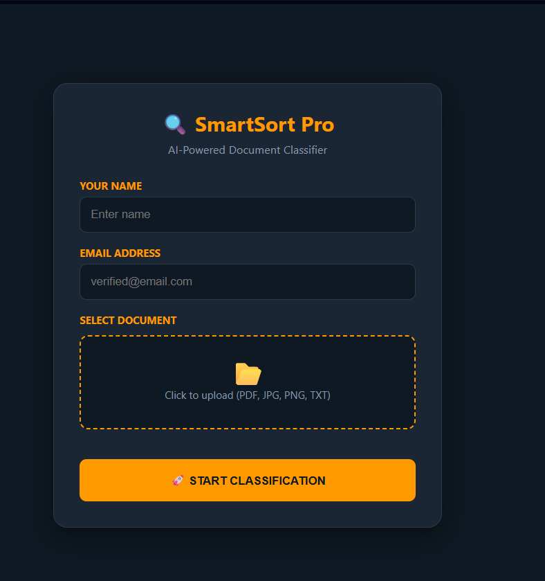
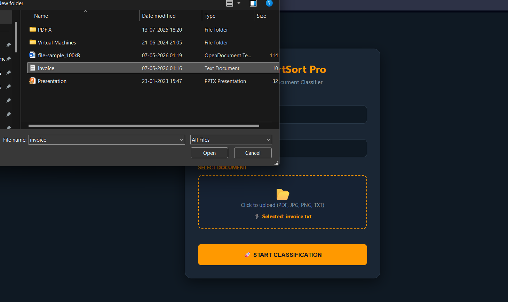
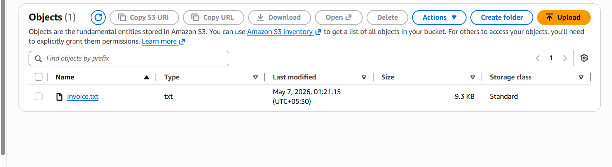
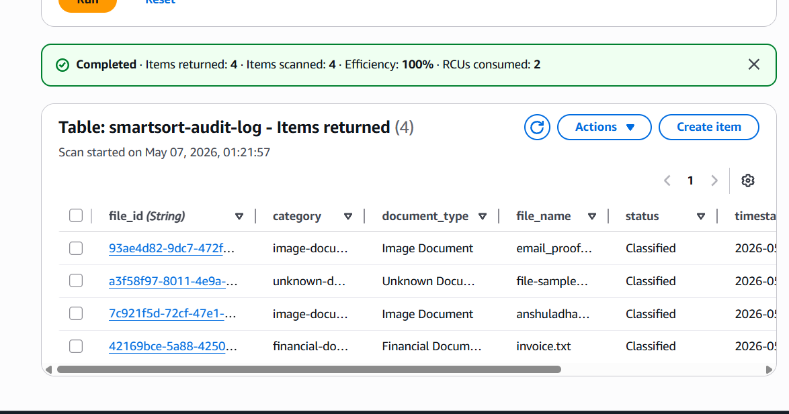
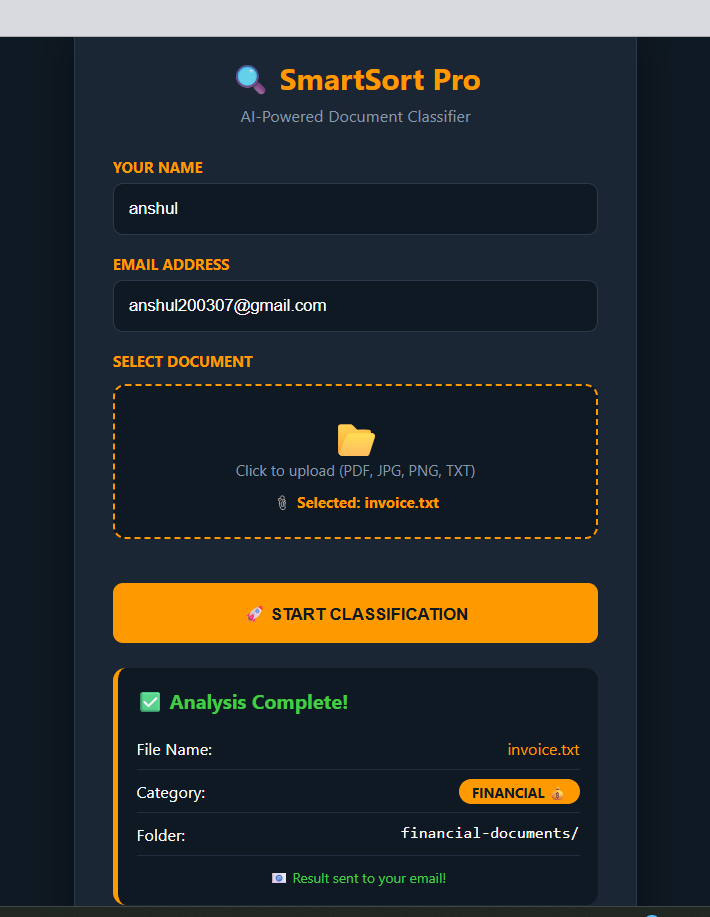
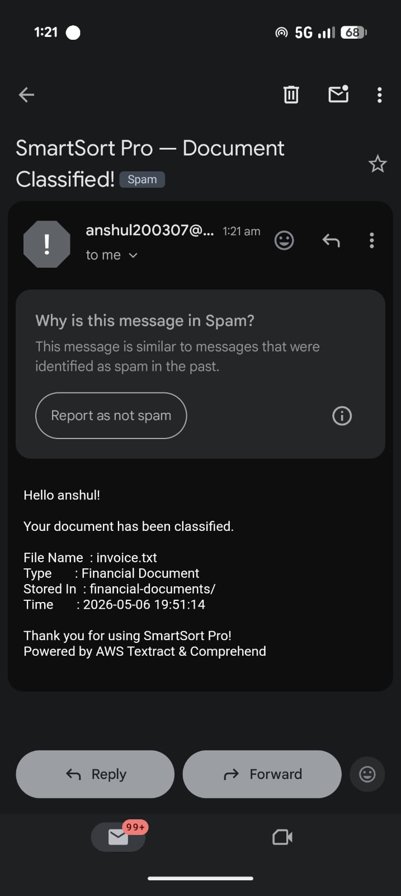

# Smartsort-Pro
SmartSort Pro — AI Powered Document Classifier

# 📌 Overview

SmartSort Pro is a serverless AWS project that automatically classifies uploaded documents using AI services like AWS Textract and Amazon Comprehend. The system analyzes files, detects document type, stores them in categorized S3 folders, logs activities in DynamoDB, and sends email notifications using SES.

---

# 🚀 Features

AI-based document classification

Detects Text, Image, Financial & PII documents

Text extraction using Textract

PII detection using Comprehend

Email notifications with SES

Audit logging with DynamoDB

Static website hosted on S3

Fully serverless architecture

---

# 🛠️ AWS Services Used

Amazon S3

AWS Lambda

Amazon Textract

Amazon Comprehend

Amazon DynamoDB

Amazon SES

Amazon API Gateway

IAM

---

# 🏗️ Architecture

User → S3 Website → API Gateway → Lambda
      → Textract & Comprehend
      → S3 Classification
      → DynamoDB Log
      → SES Email

---

# 📂 Document Categories

text-documents

image-documents

pii-documents

financial-documents

unknown-documents

---

# 📸 Project Workflow Screenshots

# 1. Website Home Page

   

# 2. User Filling Upload Form

 

# 3. File Uploaded in S3 Folder

 

# 4. DynamoDB Audit Log Entry

 

# 5. Classification Result on Website

 

# 6. Email Notification Received

---

⚙️ Tech Stack

Frontend: HTML, CSS, JavaScript

Backend: Python (AWS Lambda)

Cloud: AWS Serverless Services

---

📈 Learning Outcomes

Serverless Architecture

AWS AI Services

API Integration

Cloud Storage & Automation

Real-world AWS Deployment

---

